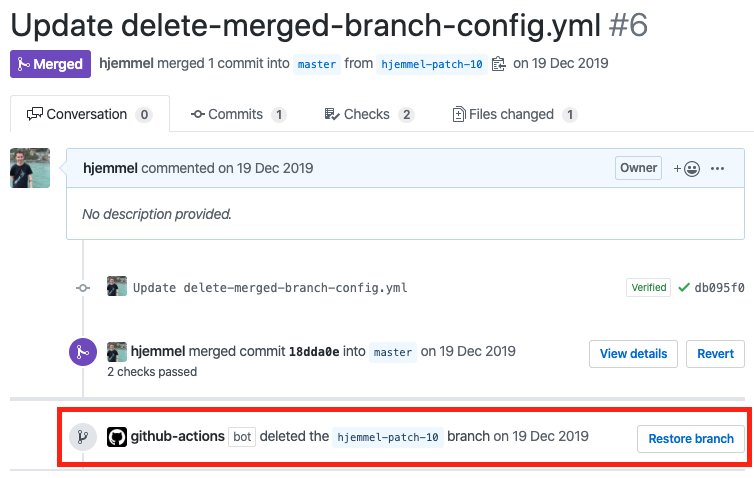

# Branch cleanup Action

 > GitHub action delete branchs after pull-request is merged

GitHub action using [@jessfraz](https://github.com/jessfraz/branch-cleanup-action/) implementation described in her [blog post](https://blog.jessfraz.com/post/the-life-of-a-github-action/).

## Screenshot



## Setup

Just change the branches that you want to perform the action.

> Notice that the branch deleted will be the one that you open the pull request and not the ones you specify bellow for exemple: __feature/label__ to __develop__, the branch deleted will be __feature/label__ and not __develop__.

```yaml
branches:
      - master
      - develop*
```

## Scripts

- [Delete merged branchs](./.github/delete-merged-branch-config.yml) - _Deletes a branch after a pull request is merged_

## Security

You might be thinking if it will delete some branch that not meant to be deleted.

* Deleted branches can be recovered
* You can protect your branches 